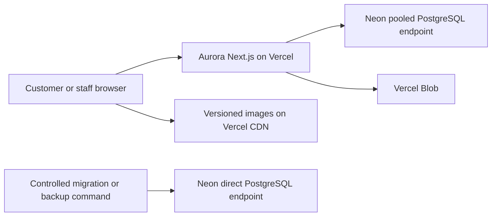

# Aurora Hotel Cloud Deployment and Storage Design

Date: 2026-07-31  
Status: Approved in chat; committed for written-spec review  
Scope: Graduation-demo deployment and managed storage  
Supersedes: Undecided managed PostgreSQL and Cloudinary deployment choices in
the existing Aurora design and plans

## 1. Purpose

Aurora Hotel will run without a mandatory local PostgreSQL or Docker
dependency. Development, automated testing, previews, and production will use
isolated Neon PostgreSQL databases. The Next.js application will deploy to
Vercel, immutable demo images will ship with the application, and media uploaded
through the administration area will use Vercel Blob.

The selected stack is:

| Capability | Selected provider | Initial tier |
|---|---|---|
| Application hosting | Vercel | Hobby |
| PostgreSQL | Neon | Free |
| Immutable demo images | Git repository and Vercel CDN | Included with deployment |
| Administrator-uploaded media | Vercel Blob | Hobby allowance |

This design optimizes for a graduation project that is easy to run and
demonstrate. It does not claim production service-level guarantees. No component
may automatically enable a paid tier or incur paid usage without explicit owner
approval.

## 2. Architectural boundaries

Aurora remains a modular Next.js monolith. Provider SDKs are restricted to
infrastructure adapters:

- Domain and application services depend on `Database`, `MediaProvider`, and
  job interfaces.
- Prisma owns PostgreSQL persistence but does not appear in React components.
- `VercelBlobMediaProvider` is the only module that imports the Vercel Blob SDK.
- Route handlers authenticate, authorize, validate input, and call application
  services; they do not implement storage policy.
- Static demo images are application assets, not media records managed through
  the administration area.

## 3. Environment isolation

Aurora initially uses one Neon project to remain within the free-tier model.
Each environment has a separate branch, database, role, and credentials.

| Application environment | Neon branch | Database | Database role |
|---|---|---|---|
| Local development | `development` | `aurora_development` | `aurora_development_app` |
| Automated test | `test` | `aurora_test` | `aurora_test_runner` |
| Vercel Preview | `preview` | `aurora_preview` | `aurora_preview_app` |
| Vercel Production | `production` | `aurora_production` | `aurora_production_app` |

Environment data must never be shared:

- Development and preview may contain deterministic demo data.
- Test is disposable and may be reset only by the guarded test reset command.
- Production is never reset or seeded by automated test tooling.
- Preview deployments do not connect to the production database.
- A production data copy must not be moved into development, preview, or test
  unless a future, separately approved process first anonymizes personal data.

## 4. Database connection contract

Each environment provides two PostgreSQL connections:

- `DATABASE_URL` is the pooled Neon connection used by the running application.
- `DIRECT_URL` is the direct Neon connection used only by controlled Prisma
  migrations, backup, restore verification, and narrowly scoped administrative
  commands.

The Prisma datasource uses PostgreSQL and declares the runtime and direct
connections according to the installed Prisma version. Application request
handlers must never use `DIRECT_URL`.

The following variables are server-only:

- `DATABASE_URL`
- `DIRECT_URL`
- `TEST_DATABASE_URL`
- `TEST_DIRECT_URL`
- `BLOB_READ_WRITE_TOKEN`
- Authentication, payment, email, webhook, and job secrets

Only variables deliberately prefixed for browser exposure may enter the client
bundle. Database URLs, provider tokens, and secrets must not use a public
prefix, appear in logs, be committed to Git, or be included in release
evidence.

## 5. Remote test reset guard

The existing localhost-only test reset guard will be replaced by a fail-closed
Neon test identity guard. A destructive test reset is permitted only when every
condition below is true:

1. `NODE_ENV` is `test`.
2. `DATABASE_ENVIRONMENT` is `test`.
3. `ALLOW_REMOTE_TEST_RESET` exactly matches the repository-defined test
   confirmation value.
4. The parsed hostname belongs to the approved Neon domain.
5. The parsed database name is exactly `aurora_test`.
6. The parsed role is exactly `aurora_test_runner`.
7. `TEST_DATABASE_URL` is not equal to any development, preview, or production
   connection after canonicalization.
8. A live query confirms `current_database()` is `aurora_test` and
   `current_user` is `aurora_test_runner`.
9. The production environment flag is absent.

Any missing, malformed, or contradictory signal denies the reset. The reset
tool prints only non-secret identity fields and never prints a connection URL.

Integration and E2E tests use `TEST_DATABASE_URL` as the application
`DATABASE_URL`. Destructive setup is serialized so parallel workers cannot
reset a database that another worker is using.

## 6. Schema migration and release

Migrations are not run from request handlers and are not an implicit side
effect of application startup.

The release sequence is:

1. Install the locked dependency graph.
2. Generate and validate the Prisma client.
3. Run lint, typecheck, unit, integration, build, and E2E gates.
4. Back up the target database before a destructive or irreversible migration.
5. Apply committed migrations through the environment's `DIRECT_URL`.
6. Run schema and application smoke checks.
7. Deploy or promote the exact verified commit to Vercel.
8. Record sanitized release evidence.

Migration failure stops the release. The application must not deploy against a
partially migrated schema. Roll-forward is the default recovery strategy;
restore is reserved for an approved recovery event.

## 7. Media storage

### 7.1 Immutable demo media

Curated demo images remain under `public/images/aurora/` and are versioned in
Git. Next.js and Vercel serve them as immutable application assets. They are
not copied into Neon or Vercel Blob during deployment.

These assets may be replaced later without changing database identifiers. Demo
images do not require visible placeholder or licensing labels inside the user
interface, but their provenance must remain documented in project records.

### 7.2 Administrator-uploaded media

Administration uploads use `VercelBlobMediaProvider`. The database stores
metadata and references, never image binary data:

- Provider and provider object key
- Public delivery URL after publication
- SHA-256 digest
- Detected MIME type
- Byte size, width, and height
- Alternative text and locale
- Validation and publication status
- Creator and audit references
- Creation, publication, trash, and purge timestamps

The upload lifecycle is:

1. An authorized Manager or Administrator requests an upload intent.
2. The server validates the requested file name, declared MIME type, size, and
   ownership context.
3. The server issues a short-lived, purpose-limited upload authorization.
4. The client uploads to Vercel Blob.
5. A server-owned completion path verifies the object exists, downloads or
   streams it for inspection, checks magic bytes, decodes it as an image,
   verifies dimensions and size, strips metadata by re-encoding when required,
   and calculates the digest.
6. Invalid objects are rejected and scheduled for deletion.
7. Valid objects enter `READY`.
8. A separate authorized publication action changes the asset to `PUBLISHED`.

Allowed source formats are JPEG, PNG, WebP, and AVIF. SVG, executable content,
identity documents, polyglot files, and undecodable images are rejected. The
maximum is 10 MB and 6000 by 6000 pixels. An uploaded object is never rendered
as hotel content before validation succeeds.

Deletion first changes the asset to a 30-day recoverable trash state. A
deduplicated purge job deletes the provider object only after the recovery
period and records an audit event.

## 8. Booking holds and background work

Correct booking behavior must not depend solely on Vercel Cron frequency.

- Availability queries ignore expired holds according to the server clock.
- Booking and availability requests opportunistically claim and release expired
  holds with idempotent, conditional database updates.
- A scheduled sweep performs eventual cleanup of expired holds, failed media,
  outbox retries, and purge candidates.
- Replaying a sweep must not return inventory twice, send duplicate mail, or
  delete a live media object.

This request-driven plus scheduled model preserves correct availability even
when a free hosting tier cannot run frequent background jobs.

## 9. Failure and recovery behavior

| Failure | Required behavior |
|---|---|
| Neon unavailable or connection pool exhausted | Return typed `503`; preserve recoverable client state; do not fabricate availability or payment success |
| Database transaction conflict | Return typed `409` and reload the affected quote, inventory, or state |
| Migration failure | Stop release and keep the previous deployment active |
| Blob authorization or upload failure | Do not create a published media record; allow an explicit retry |
| Media validation failure | Mark rejected, hide from public rendering, and schedule safe deletion |
| Blob deletion failure | Keep the trash record and retry idempotently |
| Free quota near limit | Emit an operational warning; do not automatically upgrade |
| Free quota exhausted | Fail explicitly with operator guidance; never silently switch providers |

Booking idempotency, payment replay protection, conditional inventory updates,
and verified webhook processing remain unchanged by the hosting choice.

## 10. Vercel configuration

Vercel environments map to distinct credentials:

- Local development uses local `.env` values pointing to Neon development.
- Preview uses Vercel Preview variables pointing to Neon preview and a
  non-production Blob configuration.
- Production uses Vercel Production variables pointing only to Neon production
  and the production Blob configuration.
- Test credentials remain in the test runner or CI secret store and are not
  exposed to Vercel Preview or Production builds.

The application and Neon database should use geographically compatible regions
where the selected free tiers allow it. A region choice is recorded during
provider setup and must not be inferred silently.

Build logs, application logs, and release evidence redact credentials, tokens,
cookie values, personal data, guest details, payment evidence, and signed Blob
URLs.

## 11. Backup and restore

Before the graduation release:

- Export the production schema and data through the production `DIRECT_URL`.
- Encrypt any backup that contains personal data.
- Store backups outside the public Git repository and public Blob paths.
- Restore into the isolated `aurora_restore_test` database or a dedicated
  restore branch.
- Run schema, row-count, integrity, authentication, availability, and booking
  smoke checks against the restored copy.
- Record only sanitized commands, checksums, timestamps, and results as release
  evidence.

A backup without a successful restore rehearsal is not accepted as recovery
evidence.

## 12. Testing

### Unit

- Provider selection and missing-secret failures
- Environment-to-database routing
- Connection redaction
- Reset-guard decisions
- Media type, size, dimension, and state policies
- Idempotent cleanup and purge decisions

### Neon integration

- Prisma migration from an empty test database
- Seed and reset only on `aurora_test`
- Atomic inventory and booking transactions
- Idempotency and concurrent last-room booking
- Pool saturation and transaction retry behavior
- Negative reset attempts using development, preview, and production identities

### Vercel Blob integration

- Authorized upload and completion
- Rejection of MIME spoofing, oversized, malformed, SVG, and polyglot input
- Publication only after validation
- Idempotent trash recovery and purge
- Provider failure without a published database record

### Deployment

- Vercel Preview connects only to Neon preview
- Production connects only to Neon production
- Secrets are absent from browser bundles and retained evidence
- Migration failure blocks promotion
- Production smoke test covers public availability, one mock booking, booking
  lookup, and denied unauthorized administration access

All release claims still require the ordered gates:

`lint -> typecheck -> unit/integration -> build -> Playwright E2E`

## 13. Observability and free-tier controls

The application records sanitized health signals for:

- Database connectivity and pool pressure
- Query and transaction latency
- Failed and retried jobs
- Rejected or orphaned Blob objects
- Storage and transfer usage
- Failed migrations and restore checks

Provider quotas are checked during setup and before each release because free
allowances may change. Reaching a threshold produces a warning with the affected
provider and remediation choices. It never triggers a paid upgrade.

## 14. Required documentation changes

After this written spec is approved, the implementation plan will include:

- Change Prisma from SQLite to PostgreSQL.
- Replace localhost-only database instructions with Neon setup and isolation.
- Replace the Cloudinary deployment adapter with
  `VercelBlobMediaProvider`.
- Add the remote test reset guard and negative tests.
- Add pooled runtime and direct migration connection contracts.
- Update system context, container, deployment, data lifecycle, ERD, migration,
  backup, and release diagrams.
- Update `project-manifest.yml`, `project-blueprint.yml`, environment examples,
  operations runbooks, and release evidence contracts.
- Preserve provider interfaces so a future paid storage or database provider
  can be adopted without changing domain logic.

## 15. Acceptance criteria

This design is implemented only when:

- Aurora development runs against Neon without local PostgreSQL or Docker.
- Test, preview, and production use isolated database identities and data.
- Automated tooling proves that production cannot be reset or seeded.
- Runtime traffic uses pooled connections and migrations use direct
  connections.
- A real database-backed booking completes on a Vercel Preview deployment.
- Concurrent requests cannot oversell inventory or create duplicate bookings.
- Immutable demo media is served from the deployment CDN.
- Administrator media reaches public pages only after server-owned validation.
- No secret appears in client bundles, Git history, logs, or release evidence.
- Migration failure prevents promotion.
- Backup restore is rehearsed against an isolated target.
- Ordered quality gates, diagrams, drift, convergence, and release evidence pass.
- No paid provider feature is enabled without explicit owner approval.

## 16. Explicitly excluded

- Supabase database or storage
- Cloudinary deployment integration
- Local PostgreSQL or Docker as a required runtime dependency
- Automatic provider failover
- Automatic paid-tier upgrades
- Live card processing or storage
- Production SLA claims
- Commercial launch approval

Commercial operation requires a separate review of capacity, backup retention,
availability, support, privacy, domain, email, and payment-provider obligations.
